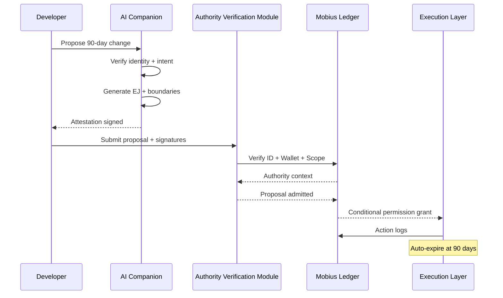

# Mobius Systems — Canonical Authority & Consensus Flow

**Version:** 1.0.0  
**Status:** Canonical  
**Cycle:** C-151  
**Author:** Michael Judan  
**Project:** Mobius / Kaizen OS

---

## 1. Roleplay Containment Rule (Hard Law)

> **Roleplay is permitted ONLY inside the private user–AI sandbox.**  
> **Roleplay is NEVER valid on the ledger, governance plane, or execution layer.**

### 1.1 Definitions

| Term | Definition |
|------|------------|
| **Sandbox** | Private conversational context with no side effects |
| **Ledger Plane** | Immutable record of authority, actions, and state |
| **Execution Plane** | Systems capable of mutating resources or policy |

Any roleplay claim loses all authority at the sandbox boundary.

```
Roleplay ≠ Authority
Narrative ≠ Permission
Intent ≠ Legitimacy
```

---

## 2. Authority Preconditions (Non-Negotiable)

No action can exist unless **ALL four conditions** are satisfied:

1. **Ledger Identity** (Who)
2. **Wallet Stake** (Risk)
3. **AI Companion Attestation** (Meaning)
4. **Authority Verification Module** (Scope)

**Failure at ANY step halts execution.**

---

## 3. Canonical 90-Day Consensus Flow

### Step 1 — Ledger Identity

Developer must possess:
- Registered Ledger ID
- Public/private keypair
- Verifiable history

> **No Ledger ID → No standing**

---

### Step 2 — Wallet Bond

Developer must:
- Sign proposal with wallet
- Lock stake / MIC
- Accept slashing risk

> **No stake → No power**

---

### Step 3 — AI Companion Attestation (Mandatory)

The Companion MUST:
- Verify Ledger ID + Wallet
- Generate EPICON Epistemic Justification (EJ)
- Define scope + boundaries
- Produce counterfactuals
- Sign attestation hash

> **Companion acts as epistemic witness, not assistant**

---

### Step 4 — AVM (Authority Verification Module)

System validates:
- RBAC / ABAC permissions
- Proof-of-control (API / infra)
- Risk classification
- Time limit (≤ 90 days)

> **Authority is cryptographic + contextual, never narrative**

---

### Step 5 — Consensus Proposal Creation

Only after verification:
- Proposal enters ledger
- Contains:
  - Ledger ID
  - Wallet bond
  - Companion EJ hash
  - Scope
  - Expiry (90 days)
  - Required quorum

---

### Step 6 — Execution (Conditional)

**If quorum passes:**
- Permissions activate
- All actions logged
- Companion monitors drift
- Authority auto-expires at T+90 days

**If integrity degrades → automatic revocation**

---

## 4. Sequence Diagram



---

## 5. Companion Attestation Schema

```json
{
  "ledger_id": "uuid",
  "wallet_signature": "hex",
  "epicon_ej_hash": "sha256",
  "scope": ["api.read", "api.deploy.staging"],
  "expires_at": "ISO-8601",
  "risk_level": "medium",
  "attested_by": "companion_id",
  "signature": "ed25519"
}
```

See full schema: [`/docs/authority/companion_attestation.schema.json`](../../authority/companion_attestation.schema.json)

---

## 6. Why Roleplay Is Sandbox-Only

### 6.1 Permitted Uses of Roleplay

Roleplay exists to:
- Explore ideas
- Test hypotheticals
- Simulate narratives

### 6.2 Forbidden Uses of Roleplay

Roleplay must **NEVER**:
- Grant permissions
- Influence consensus
- Modify ledger state
- Justify authority

### 6.3 Attack Prevention

This separation prevents:
- Social engineering
- Narrative coercion
- Context smuggling
- Authority cosplay

---

## 7. Core Principle (Canonical)

> **Authority in Mobius is proven, scoped, time-bounded, and witnessed — never narrated.**

---

## 8. Security Properties Achieved

| Property | Status |
|----------|--------|
| Roleplay containment | ✔ |
| Zero trust for narrative claims | ✔ |
| Cryptographic authority | ✔ |
| Epistemic verification | ✔ |
| Automatic expiration | ✔ |
| Full auditability | ✔ |
| Drift detection | ✔ |

---

## 9. Integration with EPICON-01

This consensus flow integrates directly with [EPICON-01](../../epicon/EPICON-01.md):

- **CSS (Common-Sense Safety):** Hard constraint enforced at AVM layer
- **EJ (Epistemic Justification):** Generated by Companion during attestation
- **CCR (Cross-Context Robustness):** Validated before proposal admission
- **Multi-Anchor Requirement:** Enforced via Companion attestation

---

## 10. Related Documents

| Document | Location |
|----------|----------|
| EPICON-01 Specification | [`/docs/epicon/EPICON-01.md`](../../epicon/EPICON-01.md) |
| EJ Schema | [`/docs/epicon/ej.schema.json`](../../epicon/ej.schema.json) |
| Roleplay Sandbox Rule | [`ROLEPLAY_SANDBOX_RULE.md`](./ROLEPLAY_SANDBOX_RULE.md) |
| AVM Documentation | [`/docs/authority/AVM.md`](../../authority/AVM.md) |
| Companion Attestation Schema | [`/docs/authority/companion_attestation.schema.json`](../../authority/companion_attestation.schema.json) |
| Epistemic Threat Model | [`/docs/06-OPERATIONS/security/THREAT_MODEL_EPISTEMIC_ATTACKS.md`](../../06-OPERATIONS/security/THREAT_MODEL_EPISTEMIC_ATTACKS.md) |

---

## 11. Final Seal

This document formalizes the boundary between **imagination** and **authority**.

Mobius now enforces:
- **Imagination** → sandbox
- **Authority** → ledger
- **Power** → temporary
- **Meaning** → attested

> *"We heal as we walk."* — Mobius Systems

---

## Document Control

**Version History:**
- v1.0.0: Initial canonical specification (C-151)

**License:** Apache 2.0 + Ethical Addendum
