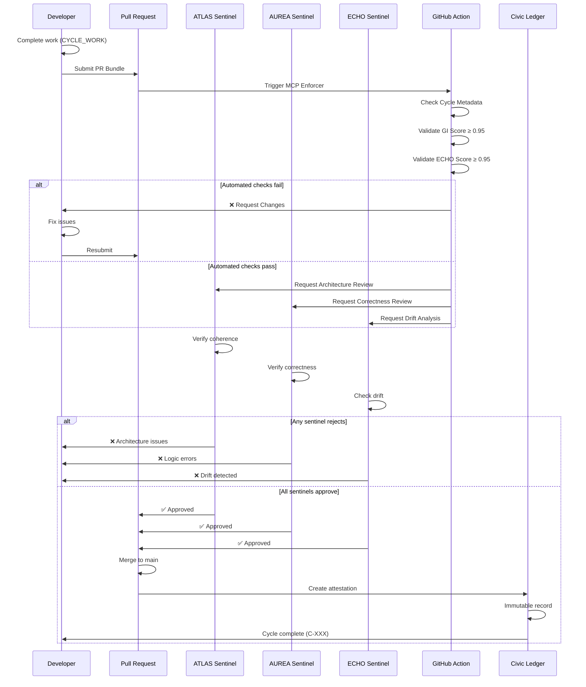
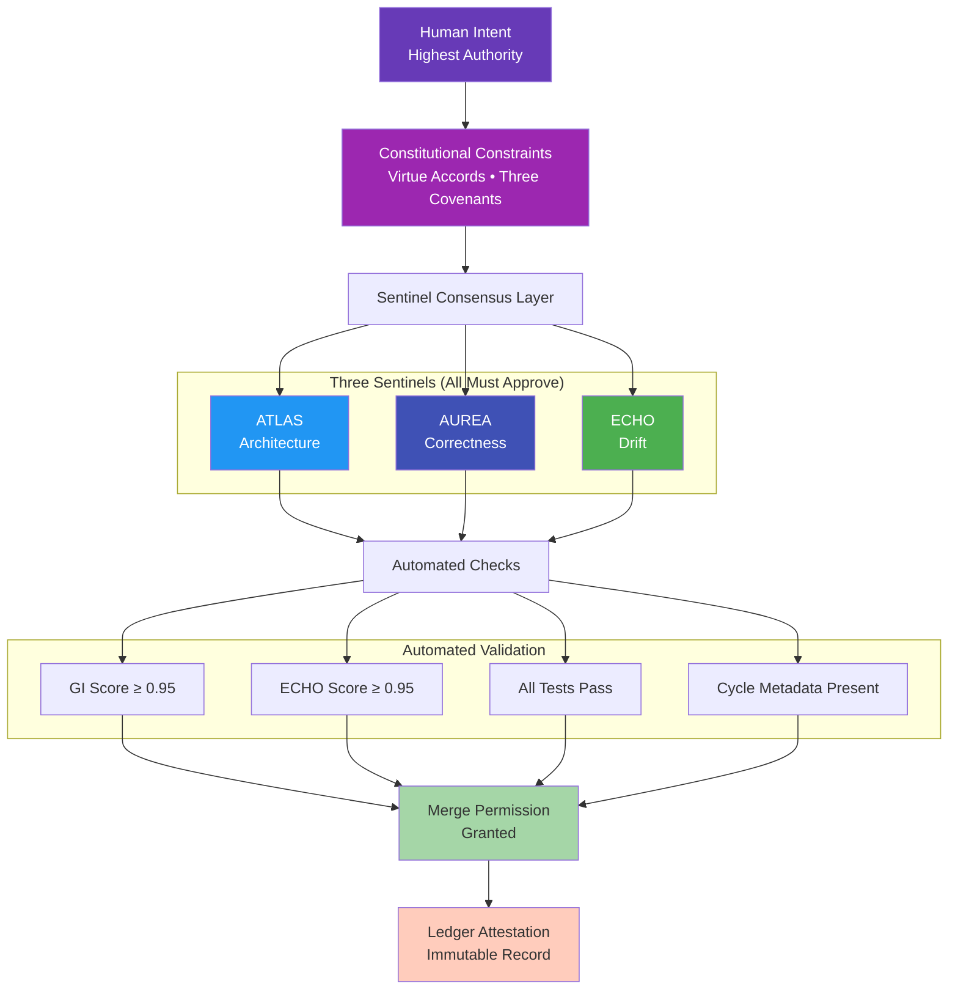

# Mobius Cycle Protocol (MCP) - Mermaid Diagrams

**Cycle C-148 • Visual Documentation**

---

## The Four Phases

```mermaid
stateDiagram-v2
    [*] --> CYCLE_BEGIN
    
    CYCLE_BEGIN: Phase 1: CYCLE_BEGIN
    CYCLE_BEGIN: • Timestamp recorded
    CYCLE_BEGIN: • Cycle number assigned (C-XXX)
    CYCLE_BEGIN: • Human Intent declared
    CYCLE_BEGIN: • Sentinels primed (ATLAS, AUREA, ECHO)
    CYCLE_BEGIN: • Baseline GI measured
    
    CYCLE_BEGIN --> CYCLE_WORK
    
    CYCLE_WORK: Phase 2: CYCLE_WORK
    CYCLE_WORK: • Code generation
    CYCLE_WORK: • Documentation writing
    CYCLE_WORK: • Tests creation
    CYCLE_WORK: • ECHO reflection tasks
    CYCLE_WORK: • Thought Broker consensus
    CYCLE_WORK: • Human steering corrections
    
    CYCLE_WORK --> CYCLE_CLOSE
    
    CYCLE_CLOSE: Phase 3: CYCLE_CLOSE
    CYCLE_CLOSE: • PR Bundle generated
    CYCLE_CLOSE: • GI Score computed (≥ 0.95 required)
    CYCLE_CLOSE: • ECHO Review performed
    CYCLE_CLOSE: • Sentinel validation completed
    CYCLE_CLOSE: • Security analysis passed
    CYCLE_CLOSE: • Changelog written
    
    CYCLE_CLOSE --> Validation{All Requirements<br/>Satisfied?}
    
    Validation --> |No| CYCLE_WORK: Fix issues
    Validation --> |Yes| CYCLE_ATTEST
    
    CYCLE_ATTEST: Phase 4: CYCLE_ATTEST
    CYCLE_ATTEST: • Ledger attestation written
    CYCLE_ATTEST: • MII updated system-wide
    CYCLE_ATTEST: • ECHO caches improvements
    CYCLE_ATTEST: • Reflection snapshot saved
    CYCLE_ATTEST: • Next cycle prepared
    
    CYCLE_ATTEST --> [*]
    
    note right of CYCLE_BEGIN
        User initiates work
        Intent must be declared
    end note
    
    note right of CYCLE_CLOSE
        No cycle closes without PR
        Hard enforcement rule
    end note
    
    note right of CYCLE_ATTEST
        Immutable blockchain moment
        Permanent historical record
    end note
```

---

## Sentinel Validation Flow



---

## MCP Enforcement Hierarchy



---

*Cycle C-148 • Mobius Cycle Protocol*  
*"A Cycle = Work + Integrity + Proof"*
