# Mobius Encyclopedia v1 — Overview

The Mobius Encyclopedia is the Mobius knowledge layer that turns multi-sentinel consensus + ECHO reinforcement into reusable, auditable entries. This document packages the diagrams and README-ready narrative requested for the Librarian track.

## Mermaid Diagrams

### High-level architecture

```mermaid
flowchart LR
    subgraph Client
      U[User / App / OAA]
    end

    subgraph EncyclopediaAPI[Encyclopedia API]
      SEED[POST /v1/encyclopedia/seed]
      SEARCH[GET /v1/encyclopedia]
      BYID[GET /v1/encyclopedia/:id]
      SVC[Encyclopedia Service]
      REPO[(Encyclopedia Repo)]
    end

    subgraph Broker[Thought Broker]
      DELIB[/POST /v1/deliberate/]
    end

    subgraph ECHO[ECHO Layer]
      ECHO_ENTRY[(Echo Memory\n(high-GI answers))]
    end

    subgraph Ledger[Civic Ledger]
      ATTEST[/POST /v1/ledger/attest/]
    end

    U -->|search q| SEARCH --> SVC
    U -->|entry id| BYID --> SVC
    SVC --> REPO
    REPO --> SVC

    %% Seeding path
    CRON[[Cron / n8n]] --> SEED --> SVC
    SVC -->|question| DELIB --> ECHO_ENTRY
    ECHO_ENTRY -->|echo-backed answer| SVC
    SVC -->|encyclopedia_entry attestation| ATTEST --> Ledger
    SVC -->|store| REPO
```

### Seeding cycle + GI / provenance

```mermaid
sequenceDiagram
    participant CRON as Cron / n8n
    participant ENC as Encyclopedia API
    participant BROKER as Thought Broker
    participant ECHO as ECHO Layer
    participant LEDGER as Civic Ledger
    participant REPO as Encyclopedia Repo

    Note over CRON: Every 6–24h
    CRON->>ENC: POST /v1/encyclopedia/seed<br/>x-encyclopedia-secret
    ENC->>ENC: pickSeedQuestion()

    ENC->>BROKER: POST /v1/deliberate { prompt, tags:["encyclopedia"] }
    BROKER->>ECHO: reinforce(question, candidateAnswers)
    ECHO-->>BROKER: echoEntry { answer, giScore, consensusLevel, sources }

    BROKER-->>ENC: deliberation { finalAnswer, giScore, echo }

    ENC->>ENC: build EncyclopediaEntry<br/>from echo + seed topics

    alt GI >= 0.93
      ENC->>LEDGER: POST /v1/ledger/attest { type:"encyclopedia_entry", ... }
      LEDGER-->>ENC: { txId }
      ENC->>REPO: save(entry + ledgerTxId)
    else GI < 0.93
      ENC->>REPO: save(entry flagged_for_review)
    end

    ENC-->>CRON: { entry }
```



## README-ready block

Use this block verbatim inside the root `README.md` or any product documentation.

### 📚 Mobius Encyclopedia (v1)

The **Mobius Encyclopedia** is the high-integrity knowledge layer of Mobius Systems.

Instead of every request re-asking an LLM and risking hallucinations, we:
- Generate answers through **multi-sentinel consensus** (Thought Broker)
- Pass them through the **ECHO Layer** (self-reflection + GI scoring)
- **Attest** them to the Civic Ledger for provenance
- Cache them as **encyclopedia entries** that any node can reuse

Over time this becomes a **shared, self-healing knowledge base** for all Mobius agents.

#### 🔍 What the Encyclopedia Does

1. **Stores** high-integrity Q&A entries:
   - `question` – natural language question
   - `answer` – echo-backed explanation
   - `topics` – tags for curriculum / search
   - `sources` – URLs / citations used
   - `giScore` – Global Integrity score (0–1)
   - `consensusLevel` – sentinel agreement level
   - `echoId` – ID in the ECHO layer
   - `ledgerTxId` – Civic Ledger attestation ID (if available)
2. **Serves** entries via a simple HTTP API:
   - `GET /v1/encyclopedia?q=...` – search by text / topic
   - `GET /v1/encyclopedia/:id` – fetch a specific entry
3. **Grows itself** via a safe seeding loop:
   - Cron or n8n hits `POST /v1/encyclopedia/seed`
   - Encyclopedia picks a seed question from our curriculum
   - Thought Broker + ECHO generate a high-GI answer
   - Civic Ledger attests provenance
   - Entry gets stored and is now queryable

#### 🧠 Why This Matters

Raw LLM usage:
- ✅ Fast
- ❌ Repeats work on every call
- ❌ Can hallucinate without warning
- ❌ No durable provenance

Mobius Encyclopedia:
- ✅ Reuses **already-vetted** answers
- ✅ Tied to GI scores and consensus
- ✅ Every entry is **auditable** via Civic Ledger
- ✅ Forms the backbone for OAA Learning Hub, HIVE Codex, Civic OS explainers, and internal docs

#### 🧩 How It Connects

```
Cron / n8n
    ↓
POST /v1/encyclopedia/seed
    ↓
Thought Broker (multi-engine deliberation)
    ↓
ECHO Layer (self-reflection + GI scoring)
    ↓
Civic Ledger (provenance attestation)
    ↓
Encyclopedia Repo (searchable store)
    ↓
GET /v1/encyclopedia (used by OAA, HIVE, etc.)
```

- Thought Broker guarantees plural reasoning (Claude, GPT, Gemini, DeepSeek…)
- ECHO guarantees self-reflection and GI scoring
- Ledger guarantees provenance
- Encyclopedia guarantees discoverability and reuse

#### 🛠️ Running Locally

```
pnpm install
pnpm --filter @mobius/encyclopedia-api dev
```

Environment variables:

```
BROKER_URL=http://localhost:8080/v1/deliberate
LEDGER_URL=http://localhost:8090/v1/ledger/attest
ENCYCLOPEDIA_CRON_SECRET=change-me
```

Health check:

```
curl http://localhost:8085/v1/health
```

Seed one entry manually:

```
curl -X POST http://localhost:8085/v1/encyclopedia/seed \
  -H "x-encyclopedia-secret: change-me" \
  -H "Content-Type: application/json" \
  -d '{}'
```

Search entries:

```
curl "http://localhost:8085/v1/encyclopedia?q=Haymarket&limit=5"
```

#### ⏰ Cron / n8n Integration

System cron example:

```
0 3 * * * /opt/mobius/infra/cron/encyclopedia_seed.sh
```

n8n flow:
- Trigger: Cron (e.g., every 6h)
- HTTP Request Node → POST `/v1/encyclopedia/seed`
- Header: `x-encyclopedia-secret: $ENCYCLOPEDIA_CRON_SECRET`
- Optional notifications + admin review steps

#### 🧭 Roadmap (v1 → v3)

- **v1**: In-memory repo, manual seed list, GI logging
- **v2**: Postgres adapter, topic coverage metrics, GI thresholds for canon vs draft, basic admin review UI
- **v3**: Node-to-node encyclopedia sync, HIVE in-game codex integration, weighted curriculum per city, MIC rewards for reviewers

### Consumers: OAA and HIVE Codex

- **OAA Learning Hub** pulls encyclopedia entries per topic, then tasks Thought Broker: “Teach this using ONLY entry ids … must cite entry ids.”
- **HIVE 16-bit MMOJRPG** surfaces entries as in-game codex panels (e.g., “Labor Relic” → query `GET /v1/encyclopedia?q=Haymarket…`). Badges show GI score + Ledger link, ensuring lore == civic canon.
- Optional “Ask Companion” flow: client posts to `/v1/deliberate` with `context.encyclopediaEntry` + constraints `no_external_facts`, `must_cite_entry_id`.

### MIC Hooks

Every manual approval / rejection inside the admin queue can mint MIC or trigger rewards: pending_review → approved transitions emit attestation + reward record. This turns librarianship into a civic job.
