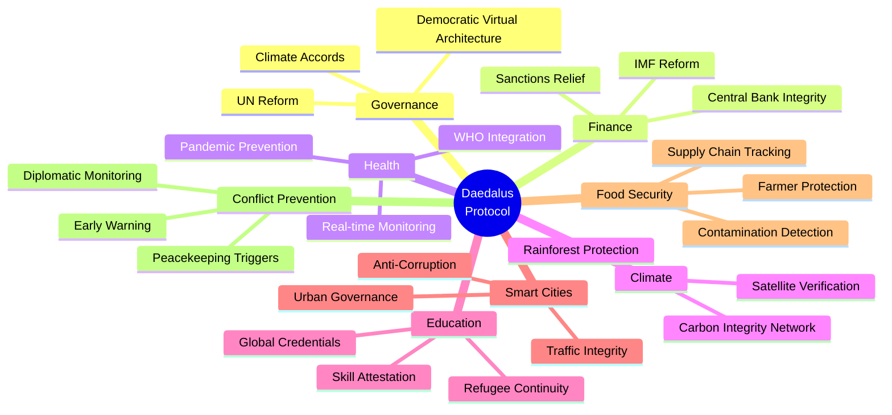
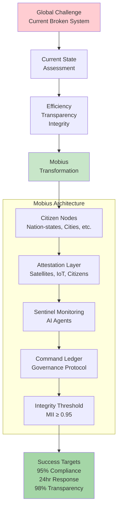
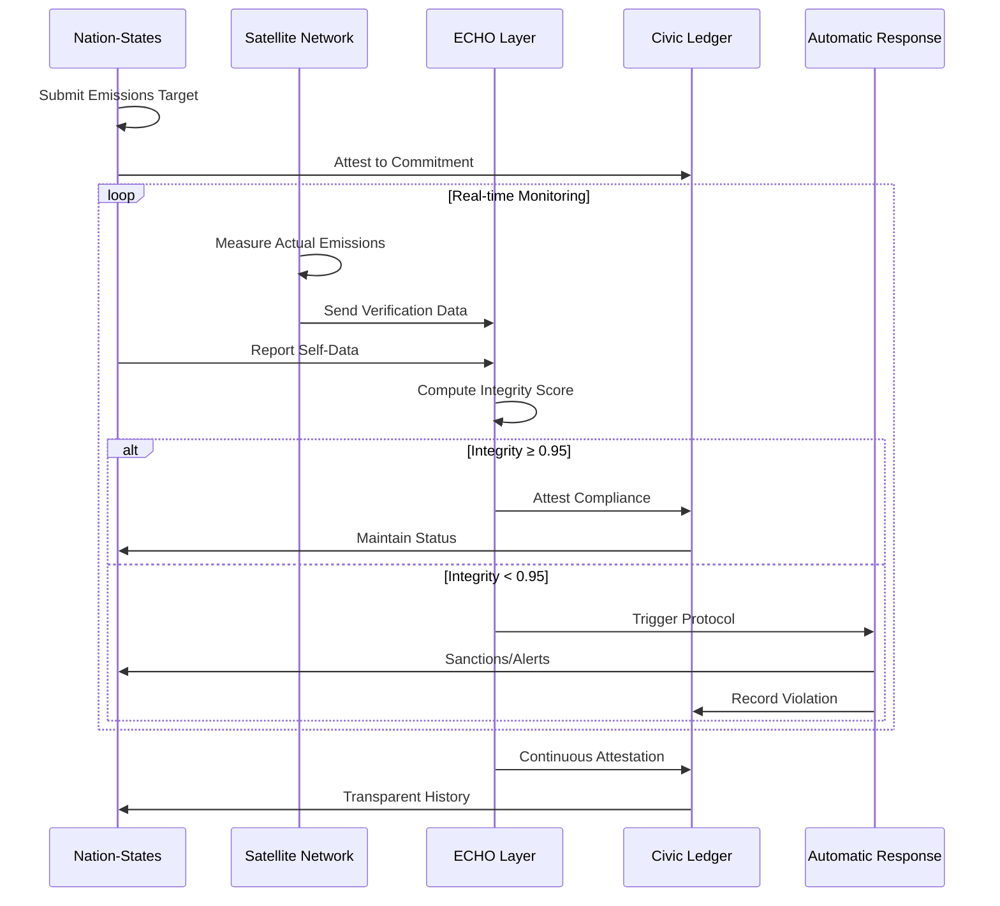

# Daedalus Protocol - Mermaid Diagrams

**Cycle C-148 • Visual Documentation**

---

## Eight Global Domains

---

## Common Daedalus Architecture Pattern

---

## Global Governance Example (Climate Accord)

---

*Cycle C-148 • Daedalus Protocol*  
*"Global challenges require global solutions."*
