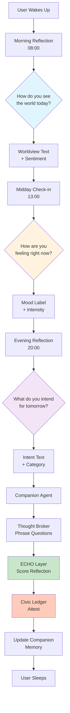
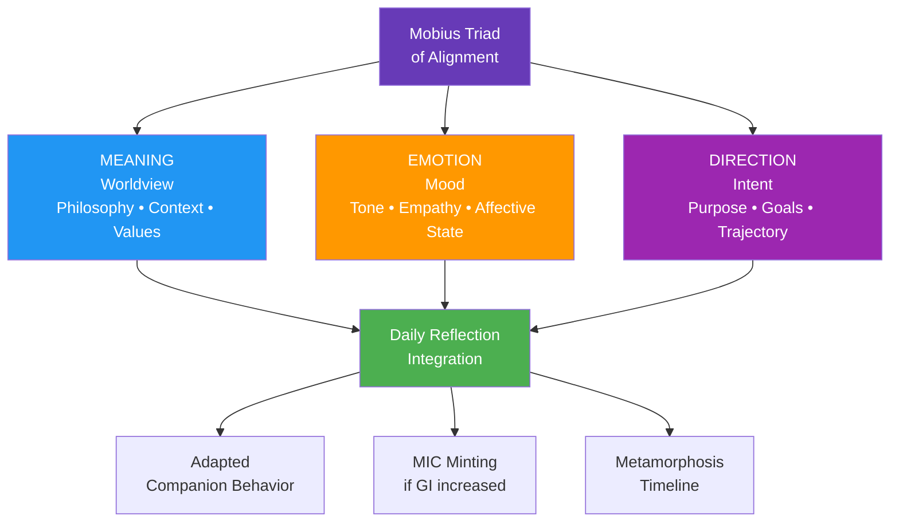
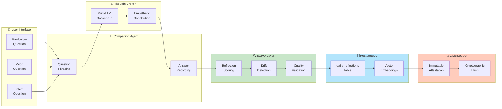

# Strange Metamorphosis Loop (SML) - Mermaid Diagrams

**Cycle C-148 • Visual Documentation**

---

## Daily Reflection Flow

---

## The Mobius Triad of Alignment

---

## SML Architecture Components

---

*Cycle C-148 • Strange Metamorphosis Loop*  
*"We heal as we walk."*
