# Strange Metamorphosis Loop (SML) - Mermaid Diagrams

**Cycle C-148 • Visual Documentation**

---

## Daily Reflection Flow

---

## The Mobius Triad of Alignment

```mermaid
graph TD
    Triad[Mobius Triad<br/>of Alignment]
    
    Triad --> Meaning[MEANING<br/>Worldview<br/>Philosophy • Context • Values]
    Triad --> Emotion[EMOTION<br/>Mood<br/>Tone • Empathy • Affective State]
    Triad --> Direction[DIRECTION<br/>Intent<br/>Purpose • Goals • Trajectory]
    
    Meaning --> Integration[Daily Reflection<br/>Integration]
    Emotion --> Integration
    Direction --> Integration
    
    Integration --> Companion[Adapted<br/>Companion Behavior]
    Integration --> MIC[MIC Minting<br/>if GI increased]
    Integration --> Timeline[Metamorphosis<br/>Timeline]
    
    style Triad fill:#673ab7,color:#fff
    style Meaning fill:#2196f3,color:#fff
    style Emotion fill:#ff9800,color:#fff
    style Direction fill:#9c27b0,color:#fff
    style Integration fill:#4caf50,color:#fff
```

---

## SML Architecture Components

---

*Cycle C-148 • Strange Metamorphosis Loop*  
*"We heal as we walk."*
