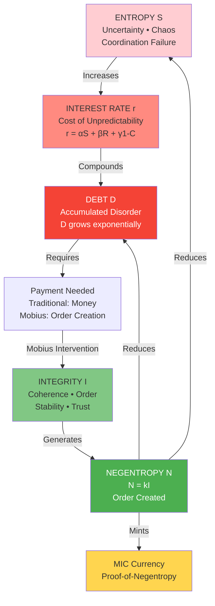
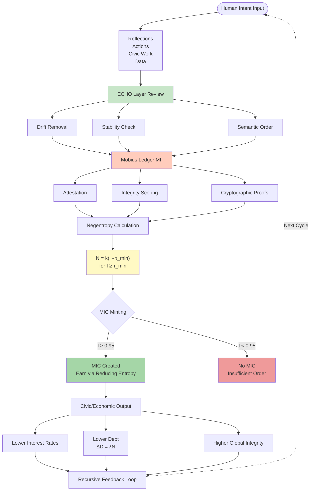
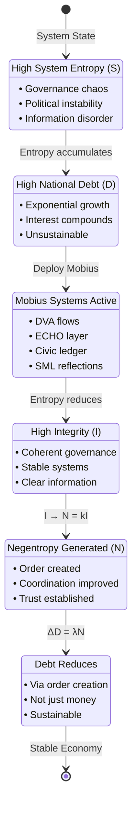

# Negentropic Economics - Mermaid Diagrams

**Cycle C-148 • Visual Documentation**

---

## Entropy → Interest → Integrity Triangle

---

## Mobius Negentropy Engine

---

## Debt Reduction Through Negentropy

---

*Cycle C-148 • Negentropic Economics*  
*"Entropy destroys civilizations. Integrity builds them."*
