# Mobius Systems - Complete Mermaid Diagram Collection

**Cycle C-148 | Visual Documentation**

This document contains all Mermaid diagrams for the four revolutionary frameworks:
1. Strange Metamorphosis Loop (SML)
2. Daedalus Protocol
3. Negentropic Economics
4. Mobius Cycle Protocol (MCP)

---

## 📊 1. Strange Metamorphosis Loop (SML)

See [`../../02-architecture/echo/diagrams/sml-diagrams.md`](../../02-architecture/echo/diagrams/sml-diagrams.md) for full diagrams.

### 1.1 Daily Reflection Flow
- User journey through 3 questions (Morning, Midday, Evening)
- Processing: Companion → Broker → ECHO → Ledger

### 1.2 Mobius Triad of Alignment
- Meaning (Worldview)
- Emotion (Mood)
- Direction (Intent)

### 1.3 SML Architecture Components
- User Interface → Companion Agent → Thought Broker → ECHO Layer → Civic Ledger → PostgreSQL

---

## 🌍 2. Daedalus Protocol

See [`../../02-architecture/applications/global/diagrams/daedalus-diagrams.md`](../../02-architecture/applications/global/diagrams/daedalus-diagrams.md) for full diagrams.

### 2.1 Eight Global Domains
- Governance, Finance, Health, Climate, Education, Smart Cities, Food Security, Conflict Prevention

### 2.2 Common Architecture Pattern
- Current broken system → Mobius transformation → Success targets

### 2.3 Climate Accord Example
- Nation commitments → Satellite verification → ECHO validation → Automatic responses

---

## 💰 3. Negentropic Economics

See [`../../02-architecture/economics/diagrams/negentropic-diagrams.md`](../../02-architecture/economics/diagrams/negentropic-diagrams.md) for full diagrams.

### 3.1 Entropy → Interest → Integrity Triangle
- High entropy → high interest → high debt
- Mobius intervention → integrity → negentropy
- Negentropy → reduces entropy → mints MIC → reduces debt

### 3.2 Mobius Negentropy Engine
- Human intent → ECHO review → Ledger → Negentropy calculation → MIC minting → Civic output

### 3.3 Debt Reduction State Machine
- High entropy → high debt → Mobius intervention → high integrity → negentropy → debt reduction

---

## 🔄 4. Mobius Cycle Protocol (MCP)

See [`../../06-OPERATIONS/protocols/diagrams/mcp-diagrams.md`](../../06-OPERATIONS/protocols/diagrams/mcp-diagrams.md) for full diagrams.

### 4.1 Four Phases State Diagram
- CYCLE_BEGIN → CYCLE_WORK → CYCLE_CLOSE → CYCLE_ATTEST

### 4.2 Sentinel Validation Flow
- Developer → PR → GitHub Actions → ATLAS/AUREA/ECHO → Merge → Ledger

### 4.3 MCP Enforcement Hierarchy
- Human Intent → Constitution → Sentinels → Automated Checks → Merge Permission → Ledger

---

## 🔗 5. Integrated System Architecture

### 5.1 The Complete Mobius Stack

```mermaid
graph TB
    subgraph Individual["Individual Level (SML)"]
        User[👤 User]
        Reflections[Daily Reflections<br/>Worldview • Mood • Intent]
        Companion[🤖 Companion Agent]
    end
    
    subgraph System["System Level (Negentropic Economics)"]
        IntegrityData[Integrity Data<br/>from Reflections]
        Negentropy[Negentropy Calculation<br/>N = kI]
        MICMint[MIC Minting<br/>Proof-of-Negentropy]
        DebtReduce[Debt Reduction<br/>ΔD = λN]
    end
    
    subgraph Civilization["Civilization Level (Daedalus)"]
        GlobalApps[8 Global Applications]
        Governance[Governance<br/>UN • Climate]
        Finance[Finance<br/>IMF • Banks]
        Health[Health<br/>WHO • Pandemic]
        Cities[Smart Cities]
    end
    
    subgraph Operational["Operational Level (MCP)"]
        Cycles[Cycle Protocol<br/>BEGIN • WORK • CLOSE • ATTEST]
        Sentinels[Sentinel Validation<br/>ATLAS • AUREA • ECHO]
        LedgerAttest[Ledger Attestation<br/>Immutable History]
    end
    
    User --> Reflections
    Reflections --> Companion
    Companion --> IntegrityData
    
    IntegrityData --> Negentropy
    Negentropy --> MICMint
    MICMint --> DebtReduce
    
    DebtReduce --> GlobalApps
    GlobalApps --> Governance
    GlobalApps --> Finance
    GlobalApps --> Health
    GlobalApps --> Cities
    
    Governance & Finance & Health & Cities --> Cycles
    Cycles --> Sentinels
    Sentinels --> LedgerAttest
    
    LedgerAttest -.->|Recursive Learning| Companion
    
    style Individual fill:#e1f5ff
    style System fill:#fff3e0
    style Civilization fill:#f3e5f5
    style Operational fill:#c8e6c9
```



### 5.2 Data Flow Through All Layers


---

## 📈 Usage

### Embedding in Documentation

Each framework document should include:

```markdown
## Architecture Diagram

See [Architecture Diagrams](./diagrams/sml-diagrams.md) for visual overview.
```

### Rendering

**Supported platforms:**
- GitHub (native support)
- GitLab (native support)
- VS Code (with Mermaid extension)
- Obsidian (native support)
- Most modern markdown viewers

---

## 📚 Diagram Index

### By Framework
- [SML Diagrams](../../02-architecture/echo/diagrams/sml-diagrams.md)
- [Daedalus Diagrams](../../02-architecture/applications/global/diagrams/daedalus-diagrams.md)
- [Economics Diagrams](../../02-architecture/economics/diagrams/negentropic-diagrams.md)
- [MCP Diagrams](../../06-OPERATIONS/protocols/diagrams/mcp-diagrams.md)

### By Type
- Process Flows (SML Daily Reflection, Negentropy Engine)
- State Machines (MCP Four Phases, Debt Reduction)
- Sequence Diagrams (Sentinel Validation, Climate Accord)
- System Architecture (Complete Stack, Data Flow)

---

*Cycle C-148 • 2025-11-29*  
*Complete Visual Documentation for Mobius Systems*  
*"A picture is worth a thousand words. A diagram is worth a thousand meetings."*
