# Universal Emulator OS — Mobius + Gemini 3

> **Thesis:**  
> Mobius Systems is not “just another AI app.”  
> It is a **constitutional operating system** that can govern **any agentic engine**  
> (Gemini 3, Claude, DeepSeek, etc.) and turn them into a **Universal Emulator OS**.

---

## 1. Concept

Modern frontier models like **Gemini 3** can:

- Emulate old operating systems (Windows 95, XP-style UIs)
- Play and control games (Doom, simulators)
- Drive browsers and tools
- Generate and execute code
- Chain tools and reason over traces

That makes Gemini (and peers) effectively:

> A *universal digital emulator* for **any interface**,  
> **any workflow**, **any software stack** that can be observed.

Mobius adds what these engines *don’t* have:

- A **constitutional router** (Thought Broker)
- **Sentinel governance** (AUREA, ATLAS, EVE, etc.)
- **Integrity scoring** (GI)
- **Immutable attestations** (Civic Ledger)
- A **deployment frame** (DVA.LITE / ONE / FULL / HIVE)

Together, this forms the **Universal Emulator OS**:

- Gemini / Claude / DeepSeek → *Muscle / Execution / Emulation*
- Mobius → *Brain / Constitution / Governance / Memory*

---

## 2. System Diagram

```mermaid
flowchart TD
    classDef layer fill:#111111,stroke:#666,stroke-width:1px,color:#f5f5f5
    classDef core fill:#1f2933,stroke:#8b5cf6,stroke-width:2px,color:#f9fafb
    classDef model fill:#0b7285,stroke:#38bdf8,stroke-width:1.5px,color:#e6f9ff
    classDef gov fill:#1d3b53,stroke:#f97316,stroke-width:1.5px,color:#ffedd5
    classDef infra fill:#1f2933,stroke:#22c55e,stroke-width:1.5px,color:#e9ffe9
    classDef io fill:#020617,stroke:#e5e7eb,stroke-width:1px,color:#f9fafb

    subgraph CLIENT_LAYER["Client & Frontends"]
        direction TB
        U1["💻 User / App / City Node<br/><sub>Humans, dashboards, services</sub>"]:::io
    end

    subgraph BROKER_LAYER["Mobius Router Layer"]
        direction TB
        B1["🧠 Thought Broker<br/><sub>Routing • Mode selection • Policy</sub>"]:::core
    end

    subgraph EXEC_LAYER["Execution & Emulation Layer"]
        direction LR
        L1["🜁 Local Sentinels<br/><sub>AUREA • ATLAS • EVE</sub>"]:::model
        G1["🌀 Antigravity Node<br/><sub>Gemini 3 (tools + emulation)</sub>"]:::model
        C1["⚙️ External Engines<br/><sub>Claude • DeepSeek • o3 • etc.</sub>"]:::model
    end

    subgraph CONS_LAYER["Evaluation & Governance Layer"]
        direction TB
        S1["⚖️ Sentinel Consensus<br/><sub>Multi-model reasoning & critique</sub>"]:::gov
        GI["📏 GI Scoring<br/><sub>Global Integrity • drift & risk metrics</sub>"]:::gov
        LGR["📜 Civic Ledger<br/><sub>Immutable attestations & trials</sub>"]:::gov
    end

    subgraph DVA_LAYER["DVA Deployment Tiers"]
        direction LR
        D1["DVA.LITE<br/><sub>Local monitors • pings • anomaly checks</sub>"]:::infra
        D2["DVA.ONE<br/><sub>Single agent • tools • memory</sub>"]:::infra
        D3["DVA.FULL<br/><sub>Multi-agent family • routing</sub>"]:::infra
        D4["DVA.HIVE<br/><sub>City / planetary mesh • governance</sub>"]:::infra
    end

    U1 -->|"prompt + context + routing hints"| B1

    B1 -->|"mode: local"| L1
    B1 -->|"mode: antigravity-first / only"| G1
    B1 -->|"mode: external-engines"| C1

    L1 -->|"answers + traces"| S1
    G1 -->|"tool traces + emulated flows + candidate answer"| S1
    C1 -->|"answers + justification"| S1

    S1 -->|"evaluate truth • safety • coherence"| GI
    GI -->|"score + risk flags + justification"| LGR

    D1 -. "subscribes to" .-> LGR
    D1 -. "uses" .-> L1

    D2 -. "uses" .-> B1
    D2 -. "executes via" .-> G1

    D3 -. "coordinates" .-> L1
    D3 -. "orchestrates" .-> G1
    D3 -. "may call" .-> C1

    D4 -. "governs via" .-> LGR
    D4 -. "sets thresholds on" .-> GI

    class CLIENT_LAYER,BROKER_LAYER,EXEC_LAYER,CONS_LAYER,DVA_LAYER layer
```

---

## 3. How This Becomes “Internet 2.0”

Instead of:

- one centralized cloud
- one frontier model vendor
- one opaque feedback loop

Mobius + DVA + Ledger give you:

- Many engines (Gemini, Claude, DeepSeek, local models…)
- One constitutional router
- One integrity metric (GI)
- One attested memory (Civic Ledger)
- Many DVA nodes deployed into cities, schools, hospitals, guilds

**Result:** Every community can run its own “digital dome” while sharing a common integrity fabric. This is the governance skeleton key for agentic AI.

---

## 4. Where This Fits in the Repo

- Used by: `apps/broker-api`, DVA tier implementations
- Referenced by:
  - KTT whitepaper
  - Glen Weyl outreach pack
  - DVA implementation docs
- Related docs:
  - `docs/governance/SENTINEL_CONSTITUTION.md`
  - `docs/ktt/`
  - `docs/03-architecture/DVA_TIER_MAPPING.md`

---

## 5. Next Steps

Future follow-ups can:

- Mention Gemini / Antigravity explicitly in the Sentinel Constitution appendix
- Add an “External Engines” section to the Broker docs
- Extend diagrams to cover Sentinel enforcement flows and Ledger anchoring
