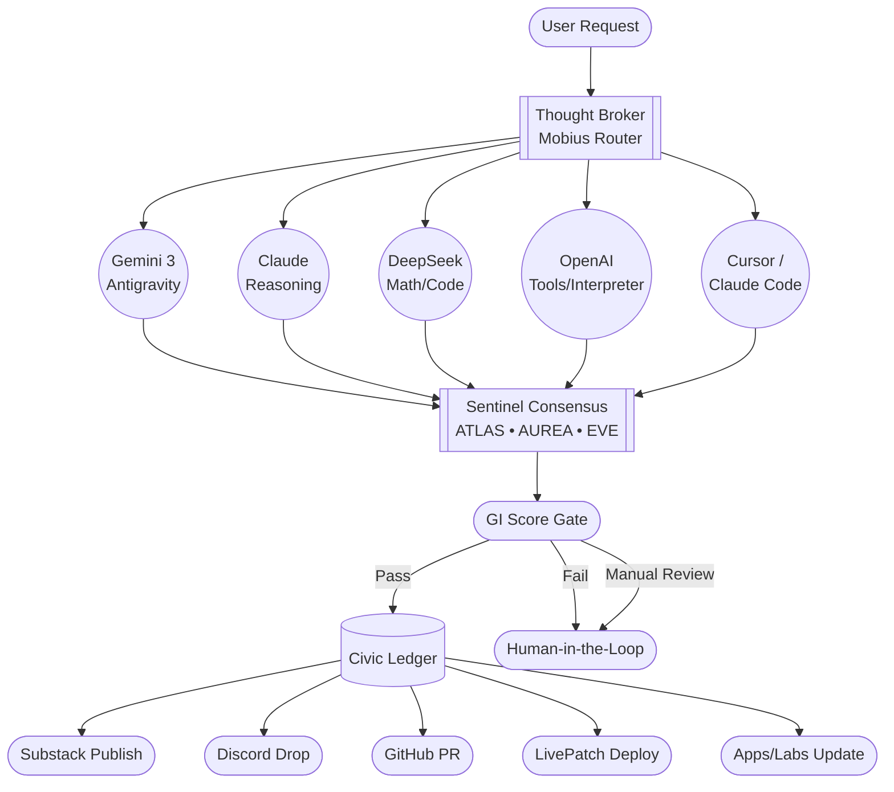

# Mobius Universal n8n Flow — Multi-Engine AI Orchestration

**Status:** Draft v0.1  
**Scope:** Architectural blueprint for n8n-style workflow integrating Thought Broker, multi-engine AI, Sentinels, GI, Civic Ledger, and human channels.

---

## 1. Purpose

This document defines the **universal Mobius orchestration flow** that:

- Accepts a user request from any client (mobile, web, CLI, Discord, Telegram, etc.)
- Routes it through **Thought Broker**, which can fan out to multiple AI engines:
  - Gemini (Antigravity)
  - Claude
  - DeepSeek
  - OpenAI (GPT/4o/tools)
  - Codex / Cursor / Claude Code (for PRs)
- Hands all resulting candidates to **Sentinel Consensus** (ATLAS, AUREA, EVE)
- Applies a **Global Integrity (GI) gate**
- Writes an attested entry into the **Civic Ledger**
- Pushes the result into one or more **human-visible channels**:
  - Substack
  - Discord
  - Telegram (human-in-the-loop)
  - GitHub (PRs)
  - LivePatch (deploy)
  - Apps / Labs (Lab4/6/7, OAA)

This is the **“Windows 95 shell” moment** for Mobius: one orchestration layer over many tools, governed by one Constitution.

---

## 2. High-Level Flow



---

## 3. Node Responsibilities

### 3.1 User Input Node

Sources:
- Web UI
- Mobile client
- CLI (`mobius ask "..."`)
- Bots (Discord / Telegram)
- System integrations (cron, webhooks)

Output (normalized envelope):

```json
{
  "prompt": "string",
  "context": "Mobius-OS | Civic | LabX | HIVE | etc.",
  "intent": "research | code | publish | deploy | reflect | notify",
  "priority": "low | normal | high",
  "allowedTools": ["search", "code", "math", "browser"],
  "userId": "optional-user-id-or-handle"
}
```

---

### 3.2 Thought Broker (Router)

Role: Decide which engines to involve and how.

Inputs:
- User envelope (above)
- System config (enabled engines, rate limits, safety modes)

Outputs:
- One or more engine requests
- Aggregated engine responses

Example intermediate structure:

```json
{
  "engines": {
    "gemini": { "status": "ok", "answer": "...", "tools": ["web-search"] },
    "claude": { "status": "ok", "answer": "...", "analysis": "..." },
    "deepseek": { "status": "ok", "math": "...", "proof": "..." },
    "gpt": { "status": "ok", "code": "...", "tests": "..." },
    "codex": { "status": "pending", "intent": "pr" }
  },
  "routingMode": "multi-engine",
  "taskType": "research+code",
  "riskProfile": "medium"
}
```

Constitutional rule: all engines are tools. None can bypass Sentinel review when GI evaluation is required.

---

### 3.3 Engine Layer (Gemini / Claude / DeepSeek / GPT / Code Agents)

Each engine is called via a dedicated node (or HTTP node in n8n) with:
- Input: normalized task description
- Output: structured candidate result

Examples:
- Gemini (Antigravity): web search + tools + emulator
- Claude: long-form reasoning, safety-aware drafting
- DeepSeek: math, algorithmic optimization, systems questions
- GPT/4o: general reasoning, tools, vision
- Codex/Cursor/Claude Code: patch/PR generation, code fixes

All outputs share a minimum schema:

```json
{
  "engine": "gemini|claude|deepseek|gpt|codex",
  "answer": "primary text output",
  "metadata": {
    "tokens": 1234,
    "latency_ms": 842,
    "tools_used": ["web-search", "code-exec"],
    "risk_flags": [],
    "engine_version": "..."
  }
}
```

---

### 3.4 Sentinel Consensus (ATLAS • AUREA • EVE)

Input:
- All engine outputs
- Original user envelope

Process (conceptual):
1. ATLAS: structural soundness, coherence, architecture
2. AUREA: alignment with Mobius Constitution & GI model
3. EVE: ethics, civic risk, human impact

Output:

```json
{
  "consensus": "approved | flagged | human_required",
  "chosen_answer": "string or structured",
  "gi": 0.0,
  "harm_score": 0.0,
  "rationale": {
    "atlas": "...",
    "aurea": "...",
    "eve": "..."
  }
}
```

---

### 3.5 GI Score Gate

- If `gi < 0.95` → fail / escalate:
  - No auto-publish
  - Send to Telegram human-in-the-loop
- If `gi >= 0.95` → pass:
  - Move to Civic Ledger
  - Route to appropriate output channels

---

### 3.6 Civic Ledger

Each approved event is written as an attested entry:

```json
{
  "id": "ledger-event-id",
  "timestamp": "ISO-8601",
  "userId": "optional",
  "engines": ["gemini", "claude"],
  "sentinels": ["atlas", "aurea", "eve"],
  "gi": 0.986,
  "intent": "publish|code|deploy|notify",
  "channels": ["substack", "github"],
  "hash": "sha256:...",
  "signature": "ed25519:..."
}
```

This provides proof-of-integrity for each action.

---

## 4. Output Channels

### 4.1 Substack

Used for:
- Essays, reflections, research drops, civic explainers.

Conditions:
- `intent = "publish"`
- `gi >= 0.97`
- Not flagged by EVE

### 4.2 Discord

Used for:
- Dev updates
- Release notes
- “Pulse” alerts
- KTT / DVA progress

### 4.3 Telegram (Human-in-the-Loop)

Used when:
- `consensus = "human_required"` OR
- `gi < 0.95` OR
- Domain = high-risk (health, finance, governance decisions)

Human moderator can:
- Approve
- Edit
- Reject
- Ask system to re-run with different parameters

### 4.4 GitHub PR

Triggered when:
- `intent = "code"`
- Codex/Cursor/Claude Code produced a patch
- GI passes code-change threshold

Actions:
- Open PR
- Attach diff + tests
- Label with GI + Sentinels
- Wait for human review

### 4.5 LivePatch Deploy

High-trust pathway, used rarely:
- Infrastructure hotfixes
- Observability tweaks
- Logging enhancements

Must always require human confirmation via Telegram/Discord.

### 4.6 Apps / Labs (Lab4 / Lab6 / Lab7)

- Writes into existing HIVE / Civic / Reflections apps
- Examples:
  - New Reflections prompt
  - New Lab6 ethics scenario
  - New Lab7 OAA curriculum update

---

## 5. n8n Implementation Notes

- Each block in the diagram maps to a node or sub-workflow:
  - User Input → Webhook / Trigger node
  - Thought Broker → HTTP node hitting Broker API
  - Engines → individual HTTP nodes for each provider
  - Sentinels → HTTP to Mobius API (`/v1/consensus`)
  - GI Gate → IF node (`gi >= 0.95`)
  - Ledger → HTTP node to Civic Ledger API
  - Channels → separate nodes (Substack, Discord, Telegram, GitHub, Deploy)
- This doc intentionally remains engine-agnostic:
  - Any LLM provider can be swapped in/out
  - Mobius remains the router + governance + ledger

---

## 6. Future Work

- Add per-domain GI thresholds (e.g., finance > 0.98, low-risk > 0.93)
- Plug in DVA tiers (LITE/ONE/FULL/HIVE) as separate monitoring layers
- Per-user learning style profiles (gamified progress, XP, badges)
- Adaptive routing:
  - Some tasks → only one engine
  - Complex tasks → multi-engine with explicit diversity

---

> “The OS of a civilization is not the fastest engine, but the one that can coordinate every engine under a single, honest sky.”

