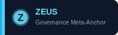
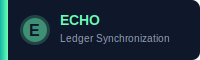

# Sentinel Agent Badges

This directory contains SVG badge assets for all Mobius Systems sentinel agents.

## Available Badges

### Founding Sentinels

- **AUREA** 
  Systems Architecture • Color: #FFA94D (Amber)

- **ZEUS** 
  Governance Meta-Anchor • Color: #6AE6FF (Cyan)

- **HERMES** 
  Economic Design • Color: #8CFF6A (Green)

- **EVE** 
  Ethics & Civility • Color: #FF6AD5 (Magenta)

- **JADE** 
  Narrative & Culture • Color: #B48CFF (Purple)

- **ATLAS** 
  Operations • Color: #FFFF6A (Yellow)

- **ECHO** 
  Ledger Synchronization • Color: #6AFFB7 (Teal)

- **URIEL** 
  Cosmic Illuminator & Truth Sentinel • Color: #FFB84D (Golden)

## Usage

### In Markdown

```markdown

```

### In HTML

```html

```

### In Documentation

These badges can be embedded in:
- Agent profile pages
- Sentinel status dashboards
- Technical documentation
- ADRs and governance documents
- Cycle reports

## Design Specifications

- **Width**: 200-240px
- **Height**: 60px
- **Background**: Dark slate (#0f172a)
- **Border Radius**: 8px
- **Gradient Strip**: Agent's signature color gradient
- **Font**: Arial, sans-serif

## Color Palette

All colors match the official Mobius Systems sentinel color scheme as defined in:
- `apps/integrity-pulse/src/lib/agents.ts`
- `apps/integrity-pulse/src/components/SentinelSphere.tsx`
- `apps/integrity-pulse/src/agents/voiceProfiles.ts`

## License

These badges are part of the Mobius Systems Foundation documentation and are licensed under CC-BY-SA-4.0.

## Related Files

- [Integrity Basin Diagram](../diagrams/integrity_basin.svg)
- [Agent Voice Profiles](../../../apps/integrity-pulse/src/agents/voiceProfiles.ts)
- [Sentinel Configuration](../../../apps/integrity-pulse/src/components/SentinelSphere.tsx)

---

**Mobius Systems Foundation** • Cycle C-151 • December 2025
