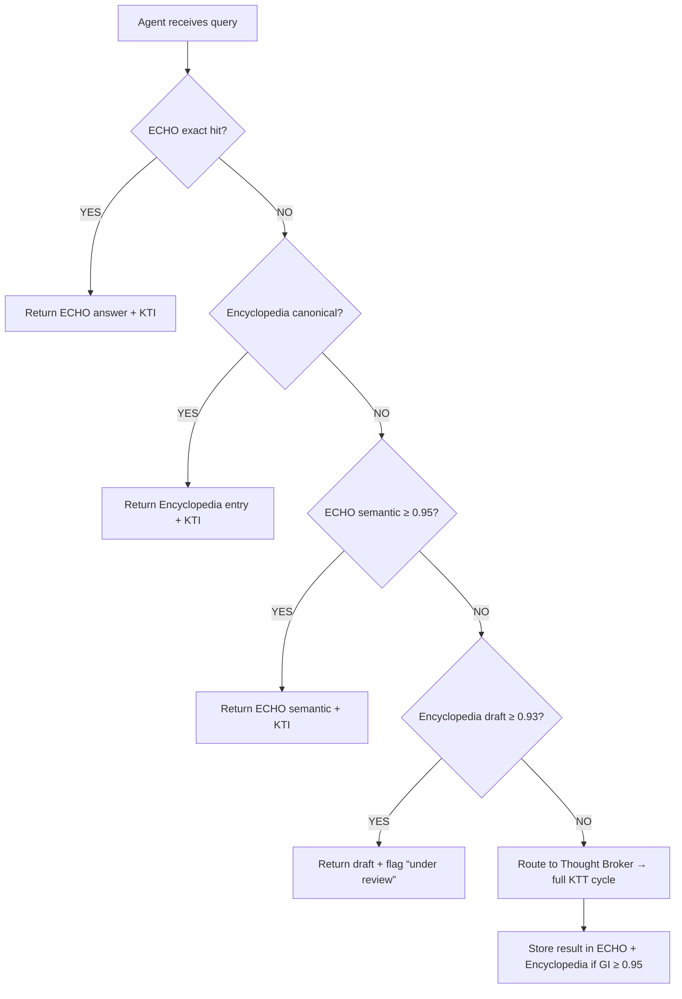

# Retrieval Priority Contract

Agents should trust already-anchored knowledge before invoking a new deliberation. The flow below prioritizes ECHO, Encyclopedia, and Draft entries before falling back to Thought Broker.



**Priority Constants** (inject via env or config):
```
PRIORITY_ECHO_EXACT   = 1.0
PRIORITY_ENC_CANON    = 0.98
PRIORITY_ECHO_SEM     = 0.95
PRIORITY_ENC_DRAFT    = 0.93
PRIORITY_FALLBACK     = 0.0
```

## SDK Helper Reference
Use the following contract (TypeScript pseudocode) for any agent SDK or orchestrator. Adjust the imports to match your actual client factories.

```ts
import { echoClient } from '@mobius/echo-client';
import { encyclopediaClient } from '@mobius/encyclopedia-client';

export async function retrieveCanon(query: string, domain?: string) {
  // 1. ECHO exact
  const echo = await echoClient.loadState(query, { domain, similarityThreshold: 1.0 });
  if (echo?.source === 'cache' && echo.giScore >= 0.95) return echo;

  // 2. Encyclopedia canonical
  const topicId = domain ? `${domain}.${slug(query)}` : slug(query);
  const enc = await encyclopediaClient.getByTopic(topicId);
  if (enc && enc.status === 'CANONICAL') {
    return { answer: enc.content, giScore: enc.giScore, source: 'encyclopedia' };
  }

  // 3. ECHO semantic
  const echoSem = await echoClient.loadState(query, { domain, similarityThreshold: 0.95 });
  if (echoSem && echoSem.giScore >= 0.95) return echoSem;

  // 4. Encyclopedia draft
  if (enc && enc.status === 'DRAFT' && enc.giScore >= 0.93) {
    return { answer: enc.content, giScore: enc.giScore, source: 'encyclopedia-draft', needsReview: true };
  }

  // 5. Fall back to Thought Broker
  return null; // callers interpret null as “run /v1/deliberate”
}

function slug(value: string) {
  return value.toLowerCase().replace(/[^a-z0-9]+/g, '_');
}
```

The helper returns the highest-priority cached context if available. A `null` response signals the agent to initiate a new deliberation and eventually feed its consensus output back into both ECHO and the Encyclopedia pipeline.
