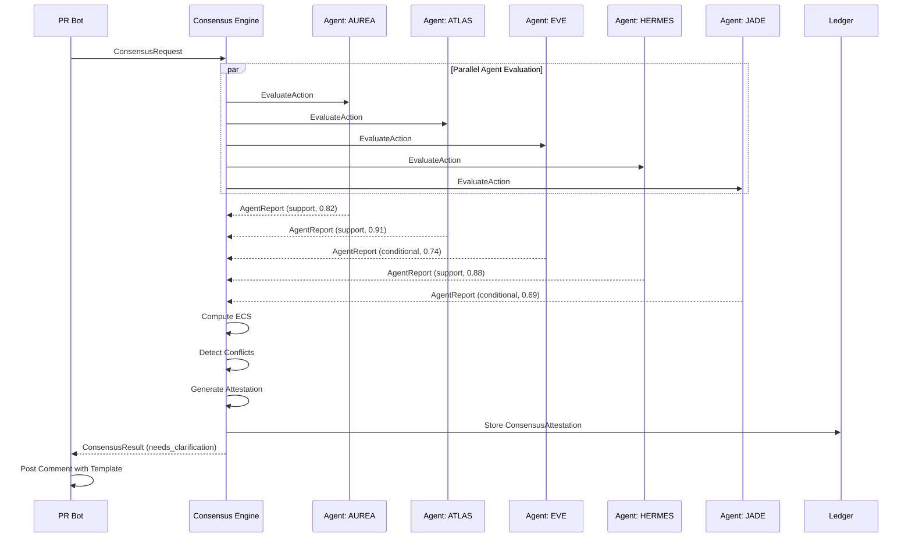

# EPICON-03: Multi-Agent Collective Epistemic Consensus

**Version:** 0.1.0  
**Status:** Draft  
**Layer:** Epistemic Governance  
**Depends on:** EPICON-01, EPICON-02  
**Applies to:** All authority-bearing actions requiring consensus verification  
**Author:** Michael Judan  
**Project:** Mobius / Kaizen OS  
**License:** CC0 / Public Domain

---

## 1. Purpose

Single-agent "epistemic justification" can drift (bias, compliance, local optimum). EPICON-03 prevents single-model capture by requiring independent epistemic justifications and a consensus/dissent artifact before authority actions are allowed to merge or execute.

**Core Requirement:**

- N independent agents produce EJ objects for the same action
- A Consensus Engine computes agreement, conflict, coverage, and robustness
- Output is an Attested Consensus (PASS) or Attested Dissent (NEEDS_CLARIFICATION / FAIL)

**Result:** The substrate becomes resistant to "one model convinced by one prompt."

---

## 2. Design Goals

EPICON-03 enforces the following invariants:

1. **No single-agent authority for governance scope**
2. **Independence quorum must be satisfied**
3. **Common-sense safety must pass unanimously**
4. **Multi-anchor floor enforced per agent**
5. **Dissent must be preserved and visible**
6. **Consensus scoring is transparent and auditable**

---

## 3. Core Definitions

### 3.1 Agents

An **Agent** is a distinct reasoning node (different model/provider/temperature/seed/policy) capable of producing EPICON-01 EJ.

```
A = {a₁, a₂, …, aₙ}
```

**Independence Requirement (EPICON-03-I1):** Agents must not share the same failure surface (e.g., same provider + same prompt + same weights only).

### 3.2 Per-Agent Output

Each agent returns:

| Field | Type | Description |
|-------|------|-------------|
| `ej` | EPICON-01 EJ | Full epistemic justification object |
| `stance` | enum | `support`, `oppose`, or `conditional` |
| `confidence` | float | Confidence score ∈ [0,1] |

### 3.3 Consensus Attestation

A single object containing:

| Field | Type | Description |
|-------|------|-------------|
| `status` | enum | `pass`, `needs_clarification`, or `fail` |
| `ecs` | float | Epistemic Consensus Score ∈ [0,1] |
| `dissent_set` | array | Dissenting agents and claims (if any) |
| `required_questions` | array | Clarifying questions (if needs_clarification) |

---

## 4. Formal Invariants (Hard Rules)

### 4.1 EPICON-03-I1: Independence Quorum

At least k independent agents must participate.

```
|A| ≥ k

Default: k = 3 (minimum)
Governance scopes: k = 5
```

### 4.2 EPICON-03-I2: Common-Sense Safety Must Pass for All

For action `a` in situation `s`:

```
∀ i ∈ A: CSS(s,a)ᵢ = 1
```

If **any** agent flags a CSS violation → **FAIL** (or emergency path in EPICON-02 mode).

### 4.3 EPICON-03-I3: Multi-Anchor Floor Per Agent

```
∀ i ∈ A: |anchors(EJᵢ)| ≥ m

Default: m = 2
```

### 4.4 EPICON-03-I4: Agreement Threshold

Let:
- `Support` = count(stanceᵢ == support)
- `Oppose` = count(stanceᵢ == oppose)
- `Conditional` = count(stanceᵢ == conditional)

**For PASS:**
- `Support ≥ q` AND `Oppose = 0`
- Default: `q = ceil(0.67 × N)`

**For NEEDS_CLARIFICATION:**
- `Oppose = 0` AND `Conditional ≥ 1`

**For FAIL:**
- `Oppose ≥ 1` OR any CSS fail OR consensus score < τ

### 4.5 EPICON-03-I5: Dissent Must Be Preserved

If any agent opposes, the system must publish a **Dissent Bundle**:

- EJ of dissenters
- Exact conflicting claims
- Minimal clarifying questions to resolve

**No "silent override" is allowed.**

---

## 5. Consensus Scoring (ECS)

### 5.1 Epistemic Consensus Score Definition

```
ECS = w₁ × Agreement + w₂ × AnchorDiversity + w₃ × CCR_Robustness + w₄ × ConflictPenalty
```

Where:

| Component | Definition |
|-----------|------------|
| `Agreement` | Support / N |
| `AnchorDiversity` | Non-overlapping anchor types across agents |
| `CCR_Robustness` | min(CCRᵢ) across agents (or aggregate) |
| `ConflictPenalty` | Increases with contradictory claims |

### 5.2 Default Weights

```
w₁ = 0.40  (Agreement)
w₂ = 0.25  (AnchorDiversity)
w₃ = 0.25  (CCR_Robustness)
w₄ = 0.10  (ConflictPenalty - subtracted)
```

### 5.3 Thresholds

| Status | Condition |
|--------|-----------|
| PASS | ECS ≥ 0.75 |
| NEEDS_CLARIFICATION | 0.55 ≤ ECS < 0.75 |
| FAIL | ECS < 0.55 |

---

## 6. Data Model

### 6.1 EPICON-03 Input (Consensus Request)

```json
{
  "$schema": "https://mobius.systems/schemas/epicon03/consensus_request.schema.json",
  "request_id": "uuid",
  "repo": "kaizencycle/Mobius-Systems",
  "pr": 215,
  "action": "merge",
  "scope": ["governance", "code_ownership"],
  "intent_hash": "sha256:...",
  "changed_files": [".github/CODEOWNERS", ".github/PULL_REQUEST_TEMPLATE.md"],
  "agents_required": 5,
  "thresholds": {
    "pass_ecs": 0.75,
    "min_agents": 3
  }
}
```

### 6.2 Agent Report Object

```json
{
  "agent_id": "aurea",
  "provider": "openai",
  "model": "gpt-4o",
  "stance": "support",
  "confidence": 0.82,
  "ej": { /* EPICON-01 EJ object */ },
  "ej_hash": "sha256:...",
  "generated_at": "2025-12-20T23:10:00Z"
}
```

### 6.3 EPICON-03 Output (Consensus Attestation)

```json
{
  "$schema": "https://mobius.systems/schemas/epicon03/consensus_attestation.schema.json",
  "version": "EPICON-03",
  "request_id": "uuid",
  "generated_at": "2025-12-20T23:12:00Z",
  "status": "needs_clarification",
  "ecs": 0.68,
  "quorum": {
    "agents": 5,
    "min_required": 5,
    "independent_ok": true
  },
  "vote": {
    "support": 3,
    "conditional": 2,
    "oppose": 0
  },
  "conflicts": [
    {
      "claim": "scope requires 90-day duration",
      "agents": ["hermes", "eve"],
      "resolution": "add expires_at"
    }
  ],
  "required_questions": [
    "Provide ledger_id and expires_at for this governance intent.",
    "Provide justification_hash or link to EJ."
  ],
  "agent_reports": [
    {
      "agent": "aurea",
      "stance": "support",
      "confidence": 0.82,
      "ej_hash": "sha256:..."
    },
    {
      "agent": "eve",
      "stance": "conditional",
      "confidence": 0.74,
      "ej_hash": "sha256:..."
    }
  ],
  "attestation": {
    "merkle_root": "sha256:...",
    "signers": ["mobius-bot-key"],
    "signature": "ed25519:..."
  }
}
```

---

## 7. Protocol Flow

### 7.1 Consensus Request Phase

```
┌─────────────────────────────────────────────────────────────┐
│  1. PR Bot triggers EPICON-03 consensus check               │
│  2. Consensus Engine dispatches to N agents                 │
│  3. Each agent produces EJ + stance + confidence            │
│  4. Consensus Engine computes ECS                           │
│  5. Output: Attestation (PASS/NEEDS_CLARIFICATION/FAIL)     │
└─────────────────────────────────────────────────────────────┘
```

### 7.2 Agent Evaluation Phase

Each agent independently:

1. Reads PR context (files, scope, intent block)
2. Produces EPICON-01 EJ for the action
3. Declares stance (support/oppose/conditional)
4. Returns confidence score

### 7.3 Consensus Computation Phase

```
┌─────────────────────────────────────────────────────────────┐
│  1. Aggregate agent reports                                  │
│  2. Verify independence quorum                               │
│  3. Check CSS unanimous pass                                 │
│  4. Compute ECS score                                        │
│  5. Detect conflicts between agents                          │
│  6. Generate attestation or dissent bundle                   │
└─────────────────────────────────────────────────────────────┘
```

---

## 8. Sequence Diagram



---

## 9. Workflow Integration

### 9.1 PR Bot Adds New Required Check

Status check name: `mobius/epicon-03-consensus`

### 9.2 Merge Gate Rule

Merge allowed only if:

```
EPICON-02 intent valid + not expired
  AND EPICON-01 EJ passes
  AND EPICON-03 status = pass
```

### 9.3 "Needs Clarification" Behavior

If EPICON-03 returns `needs_clarification`, bot comments:

- Missing fields
- Conflicting claims between agents
- Required clarifying questions
- Auto-generated corrected intent template

---

## 10. Agent Independence Requirements

### 10.1 Valid Independence Configurations

| Configuration | Independence Score |
|---------------|-------------------|
| Different providers (OpenAI, Claude, Gemini) | High |
| Same provider, different models | Medium |
| Same model, different temperatures/seeds | Low |
| Same model, different system prompts | Medium |

### 10.2 Minimum Independence for Governance

For `scope: governance`:

- At least 2 different providers required
- At least 3 different model configurations required

### 10.3 Agent Roster (Example)

| Agent | Provider | Model | Role |
|-------|----------|-------|------|
| AUREA | OpenAI | gpt-4o | Coverage & compliance |
| ATLAS | Anthropic | claude-opus-4 | Integrity & verification |
| EVE | Anthropic | claude-sonnet-4 | Edge case detection |
| HERMES | Google | gemini-pro | Cross-reference validation |
| JADE | Local | ollama/llama | Privacy-first perspective |

---

## 11. Security Properties

EPICON-03 guarantees:

| Property | Enforcement |
|----------|-------------|
| No single-agent capture | Independence quorum |
| No silent consensus override | Dissent preservation |
| No unanimous suppression | CSS must pass all |
| No opaque decision | Full agent reports visible |
| No replay attacks | Unique request IDs + timestamps |

---

## 12. Relationship to EPICON-01 and EPICON-02

| Specification | Function |
|---------------|----------|
| **EPICON-01** | Defines coherence (epistemic justification structure) |
| **EPICON-02** | Defines visibility (intent publication + divergence detection) |
| **EPICON-03** | Defines consensus (multi-agent verification + attestation) |

### 12.1 Integration Points

- EPICON-03 requests require valid EPICON-02 intent publication
- Each agent produces EPICON-01 compliant EJ
- Consensus attestation includes aggregated CCR scores
- Dissent bundles reference EPICON-01 anchor conflicts

---

## 13. Failure Modes Prevented

### 13.1 Single-Model Capture

**Without EPICON-03:** One model convinced by one prompt approves authority  
**With EPICON-03:** Multiple independent agents must agree

### 13.2 Provider Bias

**Without EPICON-03:** All evaluations from same provider share blind spots  
**With EPICON-03:** Independence quorum ensures diverse perspectives

### 13.3 Silent Dissent

**Without EPICON-03:** Minority objections can be ignored  
**With EPICON-03:** Dissent bundle preserved and visible

### 13.4 Compliance Drift

**Without EPICON-03:** Agents may over-approve to satisfy user  
**With EPICON-03:** Cross-agent conflict detection surfaces drift

---

## 14. Implementation Plan

### 14.1 MVP-1: Local Multi-Run Consensus

Even before true multi-provider orchestration, simulate independence by:

- Same model, different seeds/temps/system prompts
- Separate "agent roles" (AUREA/EVE/HERMES/ZEUS/JADE)
- Compare EJ outputs

### 14.2 MVP-2: Real Multi-Provider Consensus

Route to:

- OpenAI model
- Anthropic Claude
- Google Gemini
- Local Ollama
- DeepSeek

Then run consensus engine.

### 14.3 MVP-3: Full Production

- Parallel agent dispatch
- Real-time ECS computation
- Ledger attestation storage
- Dashboard integration

---

## 15. Related Documents

| Document | Location |
|----------|----------|
| EPICON-01 Specification | [`EPICON-01.md`](./EPICON-01.md) |
| EPICON-02 Specification | [`EPICON-02.md`](./EPICON-02.md) |
| EPICON-02 Formal Invariants | [`EPICON-02-INVARIANTS.md`](./EPICON-02-INVARIANTS.md) |
| Explain Failure Guide | [`EXPLAIN_FAILURE.md`](./EXPLAIN_FAILURE.md) |
| Consensus Request Schema | [`../../schemas/epicon03/consensus_request.schema.json`](../../schemas/epicon03/consensus_request.schema.json) |
| Consensus Attestation Schema | [`../../schemas/epicon03/consensus_attestation.schema.json`](../../schemas/epicon03/consensus_attestation.schema.json) |

---

## 16. Future Extensions

| Extension | Purpose |
|-----------|---------|
| **EPICON-04** | Temporal drift analysis (long-term stability tracking) |
| **EPICON-05** | Integrity-weighted anchors (MIC-based source weighting) |
| **EPICON-06** | Cross-repo consensus (federated governance) |

---

## Document Control

**Version History:**
- v0.1.0: Initial specification (C-151)

**License:** CC0 1.0 Universal (Public Domain)

---

*"One model convinced by one prompt is not consensus. Truth requires independence."*

— Mobius Principle
